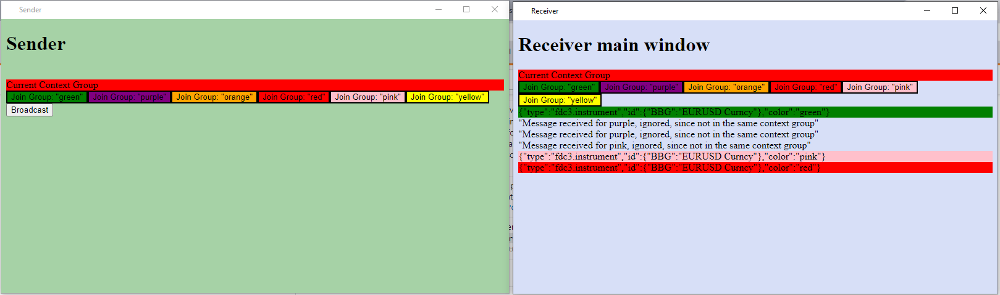

# fdc3-channels-broadcast-poc
 Use FDC3 broadcast and channels API to connect two platforms


## Running apps
```
npm run start:sender

npm run start:receiver


npm run fin:sender

npm run fin:receiver
```

